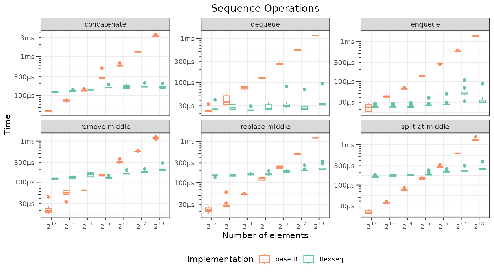
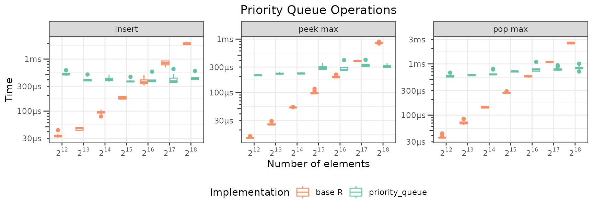
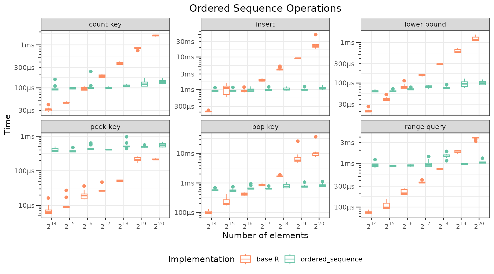
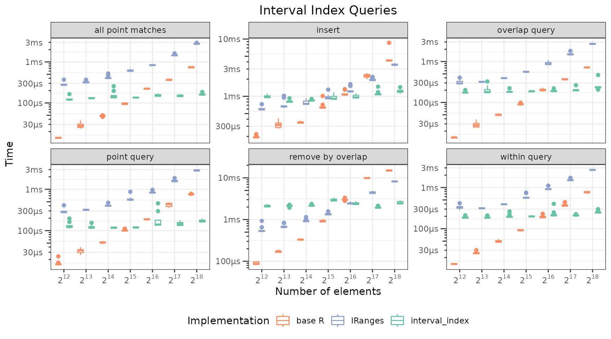

# Benchmarking immutables Collections

## Methods

This article measures individual operation times for each collection
type provided by `Immutables`. Each recorded repetition rebuilds the
setup for size *n*, then times one operation on that fresh state with
[`bench::mark()`](https://bench.r-lib.org/reference/mark.html).

**NOTE**: This script takes several hours to run in total as a result of
the large number of tests and repetitions, run serially with full
garbage collection between each. The numbers shown below are loaded from
cached results shipped with the package; re-running the cells in this
document regenerates them, as does executing the script version
`data-raw/replication/generate_publication_results.R`.

## Sequence operations

``` r

sequence_sizes <- fast_sizes(2^(12 + 0:6)) # 2^12 up to 2^18 (smallest 3 in fast mode)
rows <- flexseq()

for(n in sequence_sizes) {
  cat("Sequence ops, size ", n, "\n")
  vals <- function() as.list(sprintf("v_%06d", seq_len(n)))
  mid <- as.integer(n / 2)
  flex_setup <- function() list(s = as_flexseq(vals()), mid = mid)
  list_setup <- function() list(s = vals(), mid = mid)
  pair_flex  <- function() list(a = as_flexseq(vals()), b = as_flexseq(vals()))
  pair_list  <- function() list(a = vals(), b = vals())

  rows <- bench_one(rows, "flexseq", "enqueue", n, repeats, flex_setup,
    function(st) push_back(st$s, "d"))
  rows <- bench_one(rows, "flexseq", "dequeue", n, repeats, flex_setup,
    function(st) pop_front(st$s)$remaining)
  rows <- bench_one(rows, "flexseq", "replace middle", n, repeats, flex_setup,
    function(st) { s <- st$s; s[[st$mid]] <- "y"; s })
  rows <- bench_one(rows, "flexseq", "remove middle", n, repeats, flex_setup,
    function(st) pop_at(st$s, st$mid)$remaining)
  rows <- bench_one(rows, "flexseq", "concatenate", n, repeats, pair_flex,
    function(st) c(st$a, st$b))
  rows <- bench_one(rows, "flexseq", "split at middle", n, repeats, flex_setup,
    function(st) split_at(st$s, st$mid))

  rows <- bench_one(rows, "base R", "enqueue", n, repeats, list_setup,
    function(st) c(st$s, list("d")))
  rows <- bench_one(rows, "base R", "dequeue", n, repeats, list_setup,
    function(st) st$s[-1L])
  rows <- bench_one(rows, "base R", "replace middle", n, repeats, list_setup,
    function(st) { s <- st$s; s[[st$mid]] <- "y"; s })
  rows <- bench_one(rows, "base R", "remove middle", n, repeats, list_setup,
    function(st) st$s[-st$mid])
  rows <- bench_one(rows, "base R", "concatenate", n, repeats, pair_list,
    function(st) c(st$a, st$b))
  rows <- bench_one(rows, "base R", "split at middle", n, repeats, list_setup,
    function(st) list(
      left = st$s[seq_len(st$mid - 1L)],
      value = st$s[[st$mid]],
      right = st$s[(st$mid + 1L):n]
    ))
}

results_list$sequence <- do.call(rbind, as.list(rows))
save_batch("sequence")
```

``` r

if(!is.null(results_list$sequence)) {
  seq_results <- results_list$sequence
  sorted_sizes <- sort(unique(seq_results$n))
  seq_results$n_cat <- factor(seq_results$n, levels = sorted_sizes)

  p_sequence <- ggplot(seq_results, aes(x = n_cat, y = as.numeric(time_s), color = impl)) +
    geom_boxplot() +
    facet_wrap(~ op, scales = "free_y") +
    scale_x_discrete(labels = pow2_labels) +
    labs(
      title = "Sequence Operations",
      x = "Number of elements",
      y = "Time",
      color = "Implementation"
    ) +
    scale_y_log10(labels = label_time, guide = "axis_logticks") +
    scale_color_manual(values = c("base R" = "#fc8d62", "flexseq" = "#66c2a5")) +
    #scale_y_continuous(labels = label_time, trans = "log10") +
    theme_bw() +
    theme(plot.title = element_text(hjust = 0.5), legend.position = "bottom")
  print(p_sequence)
  save_figure(p_sequence, "benchmarks-sequence.pdf", width = 9, height = 5)
} else {
  knitr::asis_output("*Benchmark results not yet generated. Run `data-raw/replication/generate_publication_results.R` to populate.*")
}
```



## Priority queue operations

``` r

pq_sizes <- fast_sizes(2^(12 + 0:6))
rows <- flexseq()

set.seed(42)
max_pq <- max(pq_sizes)
all_pq_vals <- sprintf("val_%06d", seq_len(max_pq))
all_pq_pri  <- runif(max_pq)

for(n in pq_sizes) {
  cat("Priority queue ops, size ", n, "\n")
  pv <- as.list(all_pq_vals[seq_len(n)])
  pw <- all_pq_pri[seq_len(n)]
  pq_setup   <- function() list(pq = as_priority_queue(pv, priorities = pw))
  # Values in a list (arbitrary payloads, as the priority_queue stores);
  # priorities in a numeric vector.
  base_setup <- function() list(v = as.list(all_pq_vals[seq_len(n)]), p = pw)

  rows <- bench_one(rows, "priority_queue", "insert",   n, repeats, pq_setup,
    function(st) insert(st$pq, "val_new", 0.5))
  rows <- bench_one(rows, "priority_queue", "peek max", n, repeats, pq_setup,
    function(st) peek_max(st$pq))
  rows <- bench_one(rows, "priority_queue", "pop max",  n, repeats, pq_setup,
    function(st) pop_max(st$pq)$remaining)

  rows <- bench_one(rows, "base R", "insert",   n, repeats, base_setup,
    function(st) list(values = c(st$v, list("val_new")), priorities = c(st$p, 0.5)))
  rows <- bench_one(rows, "base R", "peek max", n, repeats, base_setup,
    function(st) st$v[[which.max(st$p)]])
  rows <- bench_one(rows, "base R", "pop max",  n, repeats, base_setup,
    function(st) { i <- which.max(st$p); list(values = st$v[-i], priorities = st$p[-i]) })
}

results_list$pq <- do.call(rbind, as.list(rows))
save_batch("pq")
```

``` r

if(!is.null(results_list$pq)) {
  pq_results <- results_list$pq
  sorted_sizes <- sort(unique(pq_results$n))
  pq_results$n_cat <- factor(pq_results$n, levels = sorted_sizes)

  p_pq <- ggplot(pq_results, aes(x = n_cat, y = as.numeric(time_s), color = impl)) +
    geom_boxplot() +
    facet_wrap(~ op, scales = "free_y") +
    scale_x_discrete(labels = pow2_labels) +
    labs(
      title = "Priority Queue Operations",
      x = "Number of elements",
      y = "Time",
      color = "Implementation"
    ) +
    theme_bw() +
    scale_color_manual(values = c("base R" = "#fc8d62", "priority_queue" = "#66c2a5")) +
    scale_y_log10(labels = label_time, guide = "axis_logticks") +
    #scale_y_continuous(labels = label_time) +
    theme(plot.title = element_text(hjust = 0.5), legend.position = "bottom")
  print(p_pq)
  save_figure(p_pq, "benchmarks-pq.pdf", width = 9, height = 3.2)
} else {
  knitr::asis_output("*Benchmark results not yet generated.*")
}
```



## Ordered sequence operations

``` r

ord_sizes <- fast_sizes(2^(14 + 0:6)) # crossover is at 2^23 for peek_key
rows <- flexseq()

set.seed(99)
max_ord <- max(ord_sizes)
all_ord_keys <- sample.int(max_ord, max_ord, replace = TRUE) # duplicates present
all_ord_vals <- sprintf("e_%06d", seq_len(max_ord))

for(n in ord_sizes) {
  cat("Ordered sequence ops, size ", n, "\n")
  keys <- all_ord_keys[seq_len(n)]
  vals <- all_ord_vals[seq_len(n)]
  sk   <- sort(keys)

  # Query key and range bounds derive from the size-n subset so they always
  # land inside the key range; the range window spans a fixed number of keys
  # so result-set size k stays roughly constant (~50) as n grows.
  qk    <- sk[n %/% 2L]
  rlo   <- sk[n %/% 2L]
  rhi   <- sk[min(n, n %/% 2L + 50L)]
  ins_k <- qk

  ord_setup  <- function() list(os = as_ordered_sequence(as.list(vals), keys = keys))
  # Naive base R ordered map: a numeric key vector and a parallel value list,
  # sorted by key. All queries are plain linear scans over the real key vector
  # (no binary search, no key encoding), so the baseline is O(n) per op and
  # key-type-agnostic. Values live in a list, as the ordered_sequence stores
  # arbitrary element payloads.
  base_setup <- function() { o <- order(keys); list(k = keys[o], v = as.list(vals[o])) }

  rows <- bench_one(rows, "ordered_sequence", "insert", n, repeats, ord_setup,
    function(st) insert(st$os, "e_new", ins_k))
  rows <- bench_one(rows, "ordered_sequence", "peek key", n, repeats, ord_setup,
    function(st) peek_key(st$os, qk))
  rows <- bench_one(rows, "ordered_sequence", "pop key", n, repeats, ord_setup,
    function(st) pop_key(st$os, qk)$remaining)
  rows <- bench_one(rows, "ordered_sequence", "count key", n, repeats, ord_setup,
    function(st) count_key(st$os, qk))
  rows <- bench_one(rows, "ordered_sequence", "range query", n, repeats, ord_setup,
    function(st) elements_between(st$os, rlo, rhi))
  rows <- bench_one(rows, "ordered_sequence", "lower bound", n, repeats, ord_setup,
    function(st) lower_bound(st$os, qk))

  rows <- bench_one(rows, "base R", "insert", n, repeats, base_setup,
    function(st) { p <- sum(st$k <= ins_k)
      list(k = append(st$k, ins_k, p), v = append(st$v, list("e_new"), after = p)) })
  rows <- bench_one(rows, "base R", "peek key", n, repeats, base_setup,
    function(st) st$v[[match(qk, st$k)]])
  rows <- bench_one(rows, "base R", "pop key", n, repeats, base_setup,
    function(st) { i <- match(qk, st$k); list(k = st$k[-i], v = st$v[-i]) })
  rows <- bench_one(rows, "base R", "count key", n, repeats, base_setup,
    function(st) sum(st$k == qk))
  rows <- bench_one(rows, "base R", "range query", n, repeats, base_setup,
    function(st) st$v[st$k >= rlo & st$k <= rhi])
  rows <- bench_one(rows, "base R", "lower bound", n, repeats, base_setup,
    function(st) which.max(st$k >= qk))
}

results_list$ordered <- do.call(rbind, as.list(rows))
save_batch("ordered")
```

``` r

if(!is.null(results_list$ordered)) {
  ord_results <- results_list$ordered
  sorted_sizes <- sort(unique(ord_results$n))
  ord_results$n_cat <- factor(ord_results$n, levels = sorted_sizes)

  p_ordered <- ggplot(ord_results, aes(x = n_cat, y = as.numeric(time_s), color = impl)) +
    geom_boxplot() +
    facet_wrap(~ op, scales = "free_y") +
    scale_x_discrete(labels = pow2_labels) +
    labs(
      title = "Ordered Sequence Operations",
      x = "Number of elements",
      y = "Time",
      color = "Implementation"
    ) +
    theme_bw() +
    #scale_y_continuous(labels = label_time) +
    scale_color_manual(values = c("base R" = "#fc8d62", "ordered_sequence" = "#66c2a5")) +
    scale_y_log10(labels = label_time, guide = "axis_logticks") +
    theme(plot.title = element_text(hjust = 0.5), legend.position = "bottom")
  print(p_ordered)
  save_figure(p_ordered, "benchmarks-ordered.pdf", width = 9, height = 5)
} else {
  knitr::asis_output("*Benchmark results not yet generated.*")
}
```



## Interval index operations

``` r

ivx_sizes <- fast_sizes(2^(12 + 0:6))
rows <- flexseq()

set.seed(123)
max_ivx <- max(ivx_sizes)
all_starts <- sort(sample.int(max_ivx * 10L, max_ivx))
all_widths <- sample.int(100L, max_ivx, replace = TRUE)
all_ends   <- all_starts + all_widths
all_vals   <- sprintf("interval_%06d", seq_len(max_ivx))

has_iranges <- requireNamespace("IRanges", quietly = TRUE) &&
  requireNamespace("S4Vectors", quietly = TRUE)

for(n in ivx_sizes) {
  cat("Interval ops, size ", n, "\n")
  starts <- all_starts[seq_len(n)]
  ends   <- all_ends[seq_len(n)]
  vals   <- all_vals[seq_len(n)]

  # Query and insertion points are derived from the size-n subset so they fall
  # inside the indexed coordinate range at every size, and the overlap window
  # spans a fixed number of starts so result-set size k stays constant
  # (~50 matches) as n grows. (Fixed global points computed from the largest
  # size would fall beyond the data for smaller n, timing only the
  # empty-result path.)
  qpt   <- starts[n %/% 2L] + 10L
  qlo   <- starts[n %/% 2L]
  qhi   <- starts[n %/% 2L + 50L]
  ins_s <- starts[n %/% 2L]
  ins_e <- ins_s + 50L

  ivx_setup  <- function() list(ix = as_interval_index(as.list(vals), start = starts, end = ends, default_query_bounds = "[]"))
  # Endpoints in a data.frame (the natural interval table); payloads in a
  # parallel list, as the interval_index stores arbitrary value objects.
  df_setup   <- function() list(df = data.frame(start = starts, end = ends), value = as.list(vals))

  rows <- bench_one(rows, "interval_index", "insert", n, repeats, ivx_setup,
    function(st) insert(st$ix, "interval_new", ins_s, ins_e))
  rows <- bench_one(rows, "interval_index", "point query", n, repeats, ivx_setup,
    function(st) peek_point(st$ix, qpt, bounds = "[]"))
  rows <- bench_one(rows, "interval_index", "all point matches", n, repeats, ivx_setup,
    function(st) peek_all_point(st$ix, qpt, bounds = "[]", as_list = TRUE))
  rows <- bench_one(rows, "interval_index", "overlap query", n, repeats, ivx_setup,
    function(st) peek_all_overlaps(st$ix, qlo, qhi, bounds = "[]", as_list = TRUE))
  rows <- bench_one(rows, "interval_index", "within query", n, repeats, ivx_setup,
    function(st) peek_all_within(st$ix, qlo, qhi, bounds = "[]", as_list = TRUE))
  rows <- bench_one(rows, "interval_index", "remove by overlap", n, repeats, ivx_setup,
    function(st) pop_all_overlaps(st$ix, qlo, qhi, bounds = "[]")$remaining)

  rows <- bench_one(rows, "base R", "insert", n, repeats, df_setup,
    function(st) list(
      df = rbind(st$df, data.frame(start = ins_s, end = ins_e)),
      value = c(st$value, list("interval_new"))
    ))
  rows <- bench_one(rows, "base R", "point query", n, repeats, df_setup,
    function(st) {
      hits <- which(st$df$start <= qpt & qpt <= st$df$end)
      if(length(hits)) st$value[[hits[1L]]] else NULL
    })
  rows <- bench_one(rows, "base R", "all point matches", n, repeats, df_setup,
    function(st) st$value[st$df$start <= qpt & qpt <= st$df$end])
  rows <- bench_one(rows, "base R", "overlap query", n, repeats, df_setup,
    function(st) st$value[st$df$start <= qhi & st$df$end >= qlo])
  rows <- bench_one(rows, "base R", "within query", n, repeats, df_setup,
    function(st) st$value[st$df$start >= qlo & st$df$end <= qhi])
  rows <- bench_one(rows, "base R", "remove by overlap", n, repeats, df_setup,
    function(st) { keep <- !(st$df$start <= qhi & st$df$end >= qlo)
      list(df = st$df[keep, , drop = FALSE], value = st$value[keep]) })

  if(has_iranges) {
    ir_setup <- function() list(
      ir = IRanges::IRanges(start = starts, end = ends),
      v  = as.list(vals)
    )

    rows <- bench_one(rows, "IRanges", "insert", n, repeats, ir_setup,
      function(st) list(
        ir = c(st$ir, IRanges::IRanges(start = ins_s, end = ins_e)),
        v  = c(st$v, list("interval_new"))
      ))
    rows <- bench_one(rows, "IRanges", "point query", n, repeats, ir_setup,
      function(st) {
        hits <- S4Vectors::subjectHits(IRanges::findOverlaps(IRanges::IRanges(start = qpt, width = 1L), st$ir))
        if(length(hits)) st$v[[hits[1L]]] else NULL
      })
    rows <- bench_one(rows, "IRanges", "all point matches", n, repeats, ir_setup,
      function(st) {
        st$v[S4Vectors::subjectHits(IRanges::findOverlaps(IRanges::IRanges(start = qpt, width = 1L), st$ir))]
      })
    rows <- bench_one(rows, "IRanges", "overlap query", n, repeats, ir_setup,
      function(st) {
        st$v[S4Vectors::subjectHits(IRanges::findOverlaps(IRanges::IRanges(start = qlo, end = qhi), st$ir))]
      })
    rows <- bench_one(rows, "IRanges", "within query", n, repeats, ir_setup,
      function(st) {
        st$v[S4Vectors::queryHits(IRanges::findOverlaps(st$ir, IRanges::IRanges(start = qlo, end = qhi), type = "within"))]
      })
    rows <- bench_one(rows, "IRanges", "remove by overlap", n, repeats, ir_setup,
      function(st) {
        hits <- S4Vectors::subjectHits(IRanges::findOverlaps(IRanges::IRanges(start = qlo, end = qhi), st$ir))
        keep <- setdiff(seq_along(st$v), hits)
        list(ir = st$ir[keep], v = st$v[keep])
      })
  }
}

results_list$ivx <- do.call(rbind, as.list(rows))
save_batch("ivx")
```

``` r

if(!is.null(results_list$ivx)) {
  ivx_results <- results_list$ivx
  sorted_sizes <- sort(unique(ivx_results$n))
  ivx_results$n_cat <- factor(ivx_results$n, levels = sorted_sizes)
  ivx_results$impl <- factor(ivx_results$impl, levels = c("base R", "IRanges", "interval_index"))

  p_ivx <- ggplot(ivx_results, aes(x = n_cat, y = as.numeric(time_s), color = impl)) +
    geom_boxplot(position = position_dodge()) +
    facet_wrap(~ op, scales = "free_y") +
    scale_x_discrete(labels = pow2_labels) +
    labs(
      title = "Interval Index Queries",
      x = "Number of elements",
      y = "Time",
      color = "Implementation"
    ) +
    theme_bw() +
    scale_color_manual(values = c("base R" = "#fc8d62", "IRanges" = "#8da0cb", "interval_index" = "#66c2a5")) +
    scale_y_log10(labels = label_time, guide = "axis_logticks") +
    #scale_y_continuous(labels = label_time) +
    theme(plot.title = element_text(hjust = 0.5), legend.position = "bottom")
  print(p_ivx)
  save_figure(p_ivx, "benchmarks-ivx.pdf", width = 9, height = 5)
} else {
  knitr::asis_output("*Benchmark results not yet generated.*")
}
```


