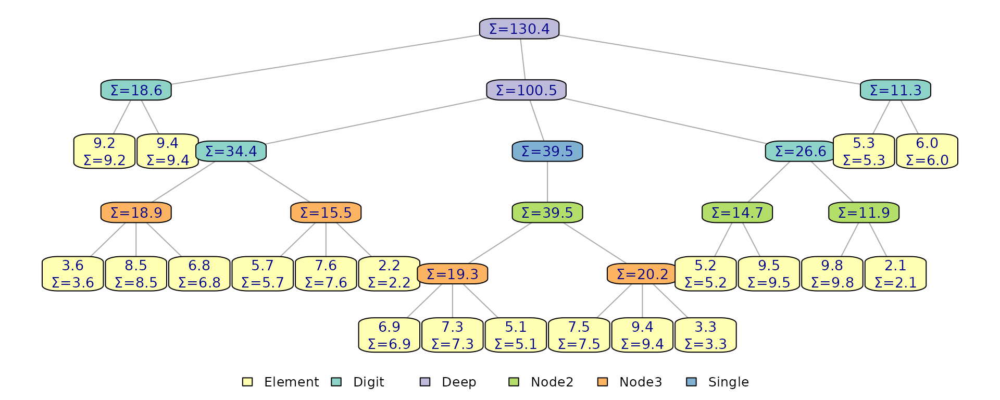

# Developer API

Every immutables structure is built on finger trees annotated with
*monoids* — cached summaries that support O(log n) search and split.
This vignette covers the developer API for defining custom monoids,
using predicate-based locate and split operations, and validating tree
invariants. These operations work uniformly across `flexseq`,
`ordered_sequence`, `priority_queue`, and `interval_index`.

## Measures and monoids

A monoid is defined by three pieces: a binary combining function `f`, an
identity value `i`, and a `measure` function that maps a single leaf
entry to its measure value. The combining function *must* be associative
(`f(a, b) == f(b, a)`), and the identity must satisfy `f(i, x) == x` and
`f(x, i) == x`.

Measure values typically represent something you would want to aggregate
over a subset of elements, with different measures and aggregations
resulting in unique properties.

When operating on a `flexseq`, you can think of a monoid’s `f` as being
applied left-to-right (a left fold), accumulating measure values at each
element. The calculation for the first element also uses `f`, which is
where `i` is used, as the other input.

    elements:  x1,  x2,  x3
    measures:  m1,  m2,  m3,  ...
    monoid-accumulated measures (infix notation):
      v1 = i %f% m1
      v2 = (i %f% m1) %f% m2            = v1 %f% m2
      v3 = ((i %f% m1) %f% m2) %f% m3   = v2 %f% m3
      ...

This left-to-rightness is only well defined for `flexseq` (using element
order defined by the user in construction), `ordered_sequence` (always
ordered by key), and `interval_index` (always ordered by interval
start). Priority queue element order is maintained internally with new
elements being added on the right, not in priority order. There may
still be uses for monoids that aggregate priority values. This is
because we can compute an aggregate over any *subsequence*, not just
prefixes. Internally elements are stored as leaf nodes in a tree
structure, and aggregating measures upward can be done purely
recursively, and cached for fast access at any level.

This monoid keeps track of the sum of values:

``` r

sum_monoid <- measure_monoid(
  f = `+`,
  i = 0,
  measure = function(el) el
)
```

Next we attach it to a structure with
[`add_monoids()`](https://oneilsh.github.io/immutables/reference/add_monoids.md),
which accepts a named list of monoids. We can pass
`show_custom_monoids = TRUE` to
[`print()`](https://rdrr.io/r/base/print.html) to see this new
information:

``` r

set.seed(42)
task_times <- runif(20, min = 1, max = 10) |>
  round(digits = 1) |>
  as_flexseq()

x <- add_monoids(task_times, list(sum = sum_monoid))

print(x, show_custom_monoids = TRUE)
#> Unnamed flexseq with 20 elements.
#> Custom monoids + measures:
#>   sum: 130.4 (aggregate)
#> 
#> Elements:
#> 
#> [[1]]
#> [1] 9.2
#>   sum measure: 9.2
#> 
#> [[2]]
#> [1] 9.4
#>   sum measure: 9.4
#> 
#> ... (skipping 16 elements)
#> 
#> [[19]]
#> [1] 5.3
#>   sum measure: 5.3
#> 
#> [[20]]
#> [1] 6
#>   sum measure: 6
```

The
[`plot_structure()`](https://oneilsh.github.io/immutables/reference/plot_structure.md)
functions visualizes the internal tree layout. Passing a function to
`node_label` lets us render both leaf values and cached structural
measures produced by monoids:

``` r

plot_structure(x, node_label = function(node) {
  if(node$type == "Element") sprintf("%.1f\nΣ=%.1f", node$element, node$measures$sum)
  else sprintf("Σ=%.1f", node$measures$sum)
})
```



The tree now caches cumulative sum annotations at every internal node,
enabling $`O(log n)`$ search by accumulated sum. Setting
`overwrite = TRUE` replaces an existing monoid with the same name.

Each structure type reserves certain monoid names for internal use
(e.g. `.size`, `.named_count`, `.pq_min`). Attempting to add a monoid
with a reserved name will error.

## Leaf entry contract

The provided `measure` function receives a structure-specific *entry*,
not just the stored value. The entry shapes are:

- **`flexseq`**: the stored element directly.
- **`ordered_sequence`**: `list(value, key)`.
- **`priority_queue`**: `list(value, priority)`.
- **`interval_index`**: `list(value, start, end)`.

This means a monoid that works on one structure type may not work on
another. Here is a monoid that sums keys on an `ordered_sequence`:

``` r

key_sum <- measure_monoid(`+`, 0L, function(entry) as.integer(entry$key))

os <- as_ordered_sequence(c("alice", "bob", "carol"), keys = c(10, 20, 30))
os <- add_monoids(os, list(key_sum = key_sum))

print(os, show_custom_monoids = TRUE)
#> Unnamed ordered_sequence with 3 elements.
#> Custom monoids + measures:
#>   key_sum: 60 (aggregate)
#> 
#> Elements (by key order):
#> 
#> [[1]] (key 10)
#> [1] "alice"
#>   key_sum measure: 10
#> 
#> [[2]] (key 20)
#> [1] "bob"
#>   key_sum measure: 20
#> 
#> [[3]] (key 30)
#> [1] "carol"
#>   key_sum measure: 30
```

## Locating and splitting by predicate

Predicate-based operations scan accumulated monoid values left-to-right
and find the first point where a predicate transitions from `FALSE` to
`TRUE`. The predicate must be *monotonic*: once it returns `TRUE`, it
must stay `TRUE` for all subsequent accumulated values. This is what
enables the $`O(log n)`$ search for a single split point.

[`locate_by_predicate()`](https://oneilsh.github.io/immutables/reference/locate_by_predicate.md)
finds the *first* element where the predicate fires, without splitting
the tree. With `include_metadata = TRUE` it returns additional scan
information. The predicate function is applied to accumulated measure
values for a given monoid name; here we find the first element where the
accumulated sum exceeds $`25`$.

``` r

loc <- locate_by_predicate(x, function(v) v > 25, "sum", include_metadata = TRUE)
str(loc)
#> List of 3
#>  $ found   : logi TRUE
#>  $ value   : num 8.5
#>  $ metadata:List of 4
#>   ..$ left_measure : num 22.2
#>   ..$ hit_measure  : num 30.7
#>   ..$ right_measure: num 84.2
#>   ..$ index        : int 4
```

The `$found` entry indicates that a node where the predicate fires was
found; if this is false the predicate is `FALSE` for all elements
through the end. The `$value` entry gives the measure of the node where
the predicate turned `TRUE`.

The optional metadata includes `left_measure` (accumulated value before
the match), `hit_measure` (the matched element’s own accumulated
measure), `right_measure` (accumulated value of everything after), and
`index` (1-based position). In this example index 4 is where the first
time where the accumulated sum is greater than 25, which we can verify
in the plot above ($`9.2 + 9.4 + 3.6 = 22.2`$, adding in $`8.5`$ brings
the sum to $`30.7`$).

[`split_by_predicate()`](https://oneilsh.github.io/immutables/reference/split_by_predicate.md)
splits the structure at the predicate point, returning `$left` and
`$right`. The matched element is the first element of `$right`:

``` r

s <- split_by_predicate(x, function(v) v > 25, "sum")
s$left
#> Unnamed flexseq with 3 elements.
#> 
#> Elements:
#> 
#> [[1]]
#> [1] 9.2
#> 
#> [[2]]
#> [1] 9.4
#> 
#> [[3]]
#> [1] 3.6
s$right
#> Unnamed flexseq with 17 elements.
#> 
#> Elements:
#> 
#> [[1]]
#> [1] 8.5
#> 
#> [[2]]
#> [1] 6.8
#> 
#> ... (skipping 13 elements)
#> 
#> [[16]]
#> [1] 5.3
#> 
#> [[17]]
#> [1] 6
```

[`split_around_by_predicate()`](https://oneilsh.github.io/immutables/reference/split_around_by_predicate.md)
is similar but extracts the matched element into a separate `$value`
field:

``` r

sa <- split_around_by_predicate(x, function(v) v > 25, "sum")
sa$left
#> Unnamed flexseq with 3 elements.
#> 
#> Elements:
#> 
#> [[1]]
#> [1] 9.2
#> 
#> [[2]]
#> [1] 9.4
#> 
#> [[3]]
#> [1] 3.6
sa$value
#> [1] 8.5
sa$right
#> Unnamed flexseq with 16 elements.
#> 
#> Elements:
#> 
#> [[1]]
#> [1] 6.8
#> 
#> [[2]]
#> [1] 5.7
#> 
#> ... (skipping 12 elements)
#> 
#> [[15]]
#> [1] 5.3
#> 
#> [[16]]
#> [1] 6
```

Both split variants accept an optional `accumulator` argument to start
scanning from a value other than the monoid identity.
[`split_at()`](https://oneilsh.github.io/immutables/reference/split_at.md)
is a convenience wrapper that splits by position using the built-in
`.size` monoid (which counts nodes; each leaf node’s measure is `1` and
it uses the `sum` operator):

``` r

split_at(x, index = 5)
#> $left
#> Unnamed flexseq with 4 elements.
#> 
#> Elements:
#> 
#> [[1]]
#> [1] 9.2
#> 
#> [[2]]
#> [1] 9.4
#> 
#> [[3]]
#> [1] 3.6
#> 
#> [[4]]
#> [1] 8.5
#> 
#> 
#> $value
#> [1] 6.8
#> 
#> $right
#> Unnamed flexseq with 15 elements.
#> 
#> Elements:
#> 
#> [[1]]
#> [1] 5.7
#> 
#> [[2]]
#> [1] 7.6
#> 
#> ... (skipping 11 elements)
#> 
#> [[14]]
#> [1] 5.3
#> 
#> [[15]]
#> [1] 6
```

## Built-in monoids in action

As described by [Hinze and
Paterson](https://www.cs.ox.ac.uk/ralf.hinze/publications/FingerTrees.pdf),
this monoid + predicate pattern is remarkably flexible. The
`priority_queue` and `ordered_sequence` types for example are not
actually separate data structures, but monoid-annotated `flexseq`
structures plus thin wrappers that invoke
[`locate_by_predicate()`](https://oneilsh.github.io/immutables/reference/locate_by_predicate.md)
and friends with the right predicate. The same primitives introduced
above power every `peek_*`, `pop_*`, and bound query in the package.
(Interval indices also follow these patterns, but are more complex than
would be useful to review here.)

### Priority queue: `.pq_min` and `.pq_max`

Priority queues store elements in insertion order, not priority order,
so a linear scan would be the only way to find the min-priority element
without some extra bookkeeping. That bookkeeping is `.pq_min` (and its
twin `.pq_max`): a monoid whose cached value at every internal node is
the smallest priority anywhere in that subtree, combined by picking the
side with the smaller priority (left-most on ties, which preserves
first-in first-out for equal priorities).

`pop_min(q)` then works in three lines of logic: read the root aggregate
as the *target* priority, form the predicate “has the accumulated
subtree absorbed a slot with this priority yet?”, and hand it to
[`split_around_by_predicate()`](https://oneilsh.github.io/immutables/reference/split_around_by_predicate.md)
over `.pq_min`. The descent uses cached subtree aggregates to prune
branches whose min is a different value, so the whole thing runs in
$`O(\log n)`$ even though the leaves themselves are not in priority
order.

### Ordered sequence: `.oms_max_key`

An ordered sequence is a `flexseq` whose elements are kept sorted by
key. Its built-in `.oms_max_key` monoid caches the largest key in each
subtree, combined by picking the larger of its two inputs.

Because the sequence is already key-ordered, the accumulated max-key is
monotonically non-decreasing left-to-right, so a predicate like “is the
running max at least my query?” transitions from `FALSE` to `TRUE`
exactly once at the correct location. The
[`lower_bound()`](https://oneilsh.github.io/immutables/reference/lower_bound.md)
function wires that predicate into
[`locate_by_predicate()`](https://oneilsh.github.io/immutables/reference/locate_by_predicate.md)
on `.oms_max_key` and returns the first element with key at or above the
target;
[`peek_key()`](https://oneilsh.github.io/immutables/reference/peek_key.md),
[`pop_key()`](https://oneilsh.github.io/immutables/reference/pop_key.md),
[`count_between()`](https://oneilsh.github.io/immutables/reference/count_between.md),
and the rest all follow the same template with different predicate
shapes and splitting/concatenating.

In practice, `.pq_min`, `.oms_max_key` and other measures are stored as
lists, containing the measure of interest (min priority value, max key
value) as well as other helper information such as the key type to
ensure consistent comparisons. The identity `i` and associative
combining function `f` operate on list-based measures of the right
shape.

## Example: DNA prefix search

Custom monoids and predicate splits combine naturally for index-style
queries. Here we build a persistent subsequence index over a DNA string
and use it to find all positions where a query pattern occurs as a
prefix.

``` r

sequence <- "ACGCGCTCGCGCATAGTCGCGCCTG"
query <- "CGCGC" # goal: find indices where query occurs
```

The idea is to store each position in the string as a value, keyed on a
subsequence long enough to contain the query (we’ll keep 10-letter
subsequences):

    key: ACGCGC..., value = 1
    key: CGCGCT..., value = 2
    key: GCGCTC..., value = 3
    ...

However, ordered sequences actually store their values in key-order:

    key: ACGCGC..., value = 1
    key: AGTCGC..., value = 15
    key: ATAGTC..., value = 13
    ...

Since they are in key-order, matches will be found in a run: all
subsequences starting with the query will be next to each other. To
extract them we just need to find the first one (a splitting operation
over a monoid), and the last (another splitting operation over a
monoid).

First we define a monoid that tracks the maximum key (subsequence
string) seen so far. The built-in `.oms_max_key` monoid already tracks
this, but we define our own to illustrate the pattern. Recall from above
that the measuring function takes a list with shape
`list(value = ..., key = ...)` when used with an `ordered_sequence`; in
this case we just need it to return the key as the measure.

We can add the monoid to an empty tree, and values for new entries will
be automatically computed on addition/removal etc.

``` r

max_seq <- measure_monoid(max, i = -Inf, measure = function(entry) entry$key)

subseqs <- ordered_sequence()
subseqs <- add_monoids(subseqs, list(max_seq = max_seq))
```

Next we index every position in the DNA string by its length-10
subsequence, inserting them into the structure:

``` r

for(i in 1:nchar(sequence)) {
  subseq <- substr(sequence, i, i + 10)
  subseqs <- insert(subseqs, i, key = subseq)
}

subseqs
#> Unnamed ordered_sequence with 25 elements.
#> 
#> Elements (by key order):
#> 
#> [[1]] (key ACGCGCTCGCG)
#> [1] 1
#> 
#> [[2]] (key AGTCGCGCCTG)
#> [1] 15
#> 
#> ... (skipping 21 elements)
#> 
#> [[24]] (key TCGCGCCTG)
#> [1] 17
#> 
#> [[25]] (key TG)
#> [1] 24
```

Now we can search for all subsequences starting with the query. First,
split to find the first entry where the measure is `>=` the query:

``` r

first_split <- split_by_predicate(subseqs, function(m) query <= m, "max_seq")
first_split$left
#> Unnamed ordered_sequence with 7 elements.
#> 
#> Elements (by key order):
#> 
#> [[1]] (key ACGCGCTCGCG)
#> [1] 1
#> 
#> [[2]] (key AGTCGCGCCTG)
#> [1] 15
#> 
#> ... (skipping 3 elements)
#> 
#> [[6]] (key CGCATAGTCGC)
#> [1] 10
#> 
#> [[7]] (key CGCCTG)
#> [1] 20
first_split$right
#> Unnamed ordered_sequence with 18 elements.
#> 
#> Elements (by key order):
#> 
#> [[1]] (key CGCGCATAGTC)
#> [1] 8
#> 
#> [[2]] (key CGCGCCTG)
#> [1] 18
#> 
#> ... (skipping 14 elements)
#> 
#> [[17]] (key TCGCGCCTG)
#> [1] 17
#> 
#> [[18]] (key TG)
#> [1] 24
```

An empty `$right` indicates no matches (all measures are less than the
query). If it’s not empty, but the first measure in `$right` does not
start with the query, then there again no matches (the key is between
the left and right but doesn’t match). We can use the
[`get_measures()`](https://oneilsh.github.io/immutables/reference/get_measures.md)
function to return a `flexseq` of measure values by name and index with
`[[1]]` to get the first measure.

If the first key in `$right` *does* start with the query, then there is
at least one match, and all matches would be in `$right`. We can split
again to find where matching keys end with a different predicate, one
that fires on the first measure that is strictly *greater* than the
query *and* no longer starts with it (resulting in the index of the
first non-match in the run).

``` r

if(length(first_split$right) > 0) {
  right_measures = get_measures(first_split$right, "max_seq")
  first_measure = right_measures[[1]]

  if(startsWith(first_measure, query)) {
    second_split <- split_by_predicate(
      first_split$right,
      function(m) query < m & !startsWith(m, query),
      "max_seq"
    )
    matches <- second_split$left
  }
}

matches
#> Unnamed ordered_sequence with 3 elements.
#> 
#> Elements (by key order):
#> 
#> [[1]] (key CGCGCATAGTC)
#> [1] 8
#> 
#> [[2]] (key CGCGCCTG)
#> [1] 18
#> 
#> [[3]] (key CGCGCTCGCGC)
#> [1] 2
```

Finally we can extract the original string positions from the matching
entries:

``` r

positions <- fapply(matches, function(value, key) value) |> unlist()
positions
#> [1]  8 18  2
```

## Validation helpers

[`validate_tree()`](https://oneilsh.github.io/immutables/reference/validate_tree.md)
checks structural invariants (monoid consistency, node structure) across
the entire tree.
[`validate_name_state()`](https://oneilsh.github.io/immutables/reference/validate_name_state.md)
verifies that a tree is either fully unnamed or fully named with unique,
non-empty names. Both are $`O(n)`$ and intended for debugging and tests.

``` r

validate_tree(x)
validate_name_state(flexseq(a = 1, b = 2, c = 3))
```
