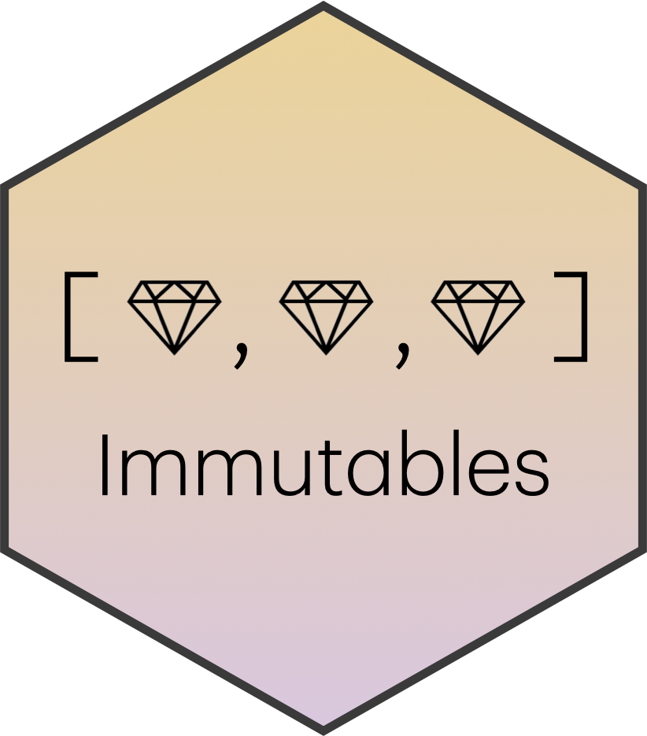

# immutables

 The `immutables` R
package implements several immutable, or persistent, data structures:
operations return modified copies while remaining fast and true to R’s
side-effect-free functional nature.

- `flexseq`s provide list-like operations including indexed and named
  element access, push/pop/peek from either end for double-ended queue
  behavior, insertion, splitting, and concatenation.
- `priority_queues` associate items with priority values and provide min
  and max peek/pop by priority and fast insertion.
- `ordered_sequences` associate items with key values and keep the
  elements in sorted order by key. These may be similarly be
  inserted/popped/peeked by key value as well as position. Keys may be
  duplicated, with first-in-first-out order within key groups.
- `interval_indexes` store items associated with interval ranges,
  supporting point as well as interval overlaps/contains/within queries.
  Items are kept in start-order enabling ordered sequence operations and
  sweep-line algorithms.

Backed by monoid-annotated 2-3 fingertrees as described by [Hinze and
Paterson](https://doi.org/10.1017/S0956796805005769), most operations
are constant time, amortized constant time, or
$O\left( \log(n) \right)$. Core functions are implemented in C++ (via
Rcpp) for speed, with matching pure-R reference implementations using
`lambda.r` syntax to match the paper.

Finally, the developer API supports the addition of custom structures
via combinations of monoids and measures; see vignettes for details.

- Hinze, R. and Paterson, R. (2006), *Finger trees: a simple
  general-purpose data structure*.

### Changelog

- 1.0: First 1.0 release
